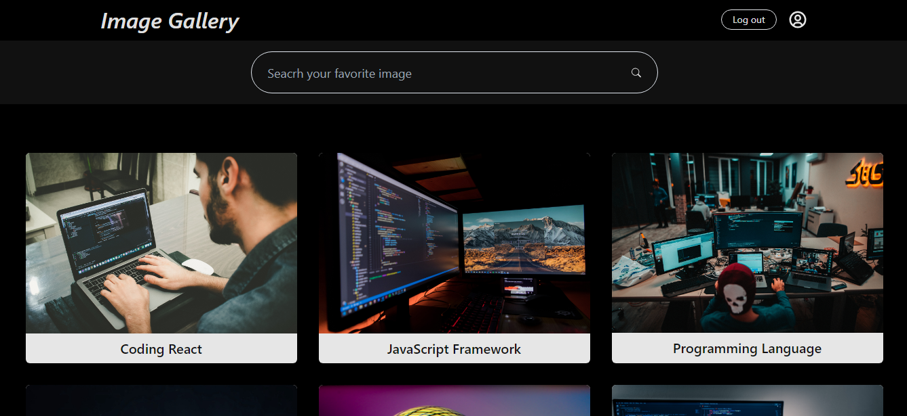

# HNG Internship - Drag and Drop Image Gallery

This is the Solution to the Stage Three Project On HNG Internship Program

## Overview

A fully functional and responsive image gallery that showcases a collection of images in a visually appealing way

### Screenshot

## Features 

- Simple Authentication with Firebase
- Image Display with Grid layout
- Search Functionality
- Drag and Drop images within the gallery
- User-friendly Feedback with react-toastify
- Responsive accross various devices

### Link

- Live Site URL: [Vercel](https://hng-stage-two-virid.vercel.app/)

## How to run this project locally on your PC

- Clone the project
- cd into the cloned project
- run - npm install (to install all the necessary packages)
- run - npm run dev
- open the link on your browser

### Built with

- Semantic HTML5 markup
- Grid
- Flexbox
- Mobile-first workflow
- React
- Firebase
- React-Toastify

## Author

- Twitter - [@jeremiahchinwe](https://www.twitter.com/jeremiahchinwe)

